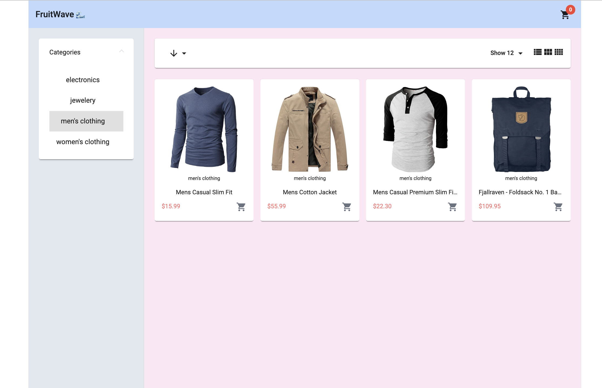
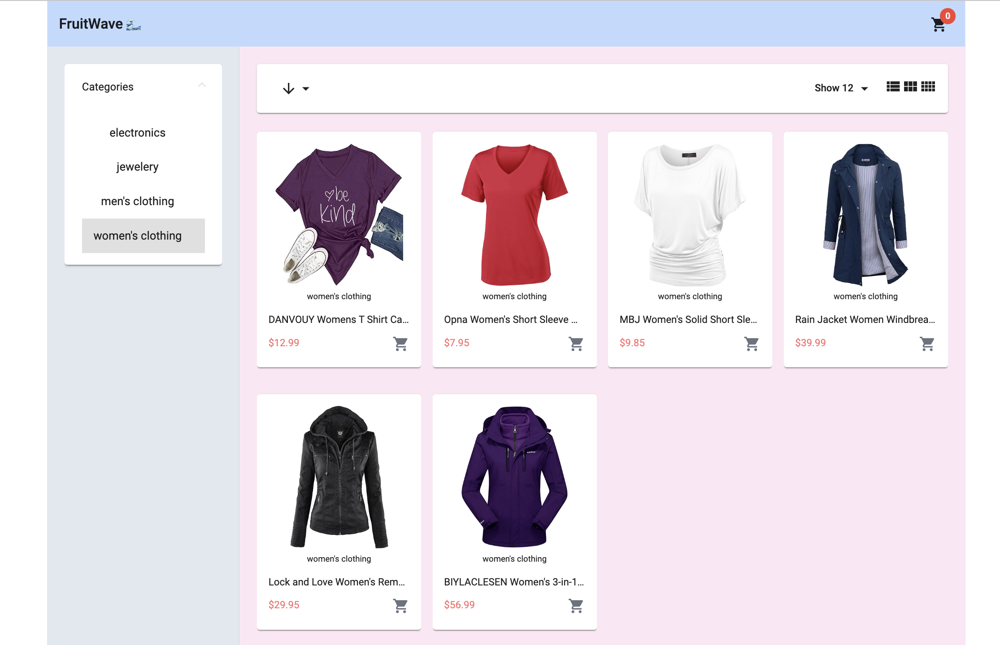
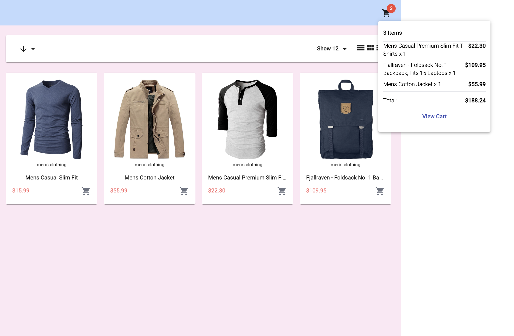
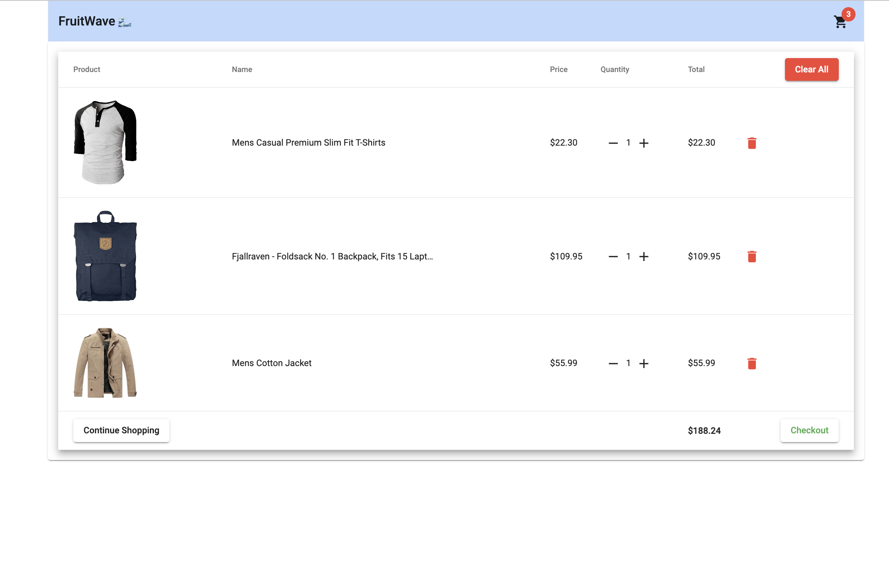
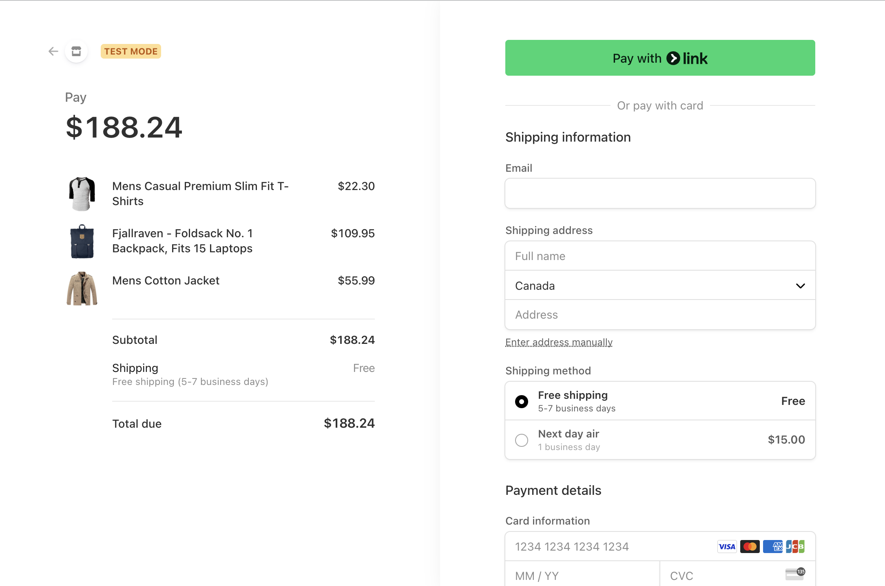

# FruitWave 🌊

FruitWave is an Angular-based e-commerce platform that allows users to browse and purchase a variety of products. This README provides an overview of its features, architecture, setup instructions, and includes screenshots for visual reference.

## Screenshots

Include screenshots of different sections of your application here to provide a visual overview.

### Home Page

### Product Listing

### Shopping Cart

### View Cart

### Stripe checkout

## Features

- **Responsive Layout**: Utilizes Angular Material components and Tailwind CSS for a responsive and modern UI.
- **Product Filtering**: Users can filter products by category using interactive filters.
- **Sorting and Pagination**: Sort products alphabetically and by price, with options to change the number of items displayed.
- **Shopping Cart**: Integrated shopping cart functionality with real-time updates on product quantity and total cost.
- **Stripe Integration**: Seamless checkout experience using Stripe for secure payment processing.

## Components and Layout

### Mat-Toolbar

The toolbar component at the top of the page includes:

- **Logo**: Linked to the home route (`/home`).
- **Shopping Cart**: Displays the number of items in the cart with a badge and provides a dropdown menu for cart details.

### Mat-Drawer-Container

- **Side Drawer**: Displays product filters for category selection.
- **Drawer Content**: Contains the main product display section, including a header component for item count, sorting options, and view mode (list or grid).

### Mat-Card

- **Product Display**: Cards dynamically rendered using Angular's `*ngFor` directive, showing product images, titles, descriptions (in expanded view), prices, and an 'Add to Cart' button.

## Functionality

- **Responsive Grid**: Adjusts product display based on screen width, with 1, 3, or 4 columns using dynamic column sizing.
- **Event Handling**: Responds to user actions such as category selection, sorting, item count changes, and view mode updates.
- **Cart Management**: Allows adding products to the cart, updating quantities, and clearing the cart using the CartService.
- **HTTP Requests**: Fetches product data and categories from a mock API (`fakestoreapi.com`) using the StoreService.

## Technologies Used

- **Angular**: Front-end framework for building single-page applications.
- **Angular Material**: UI component library for Angular applications.
- **Tailwind CSS**: Utility-first CSS framework for rapid UI development.
- **Stripe API**: Integration for secure online payments.

## Setup Instructions

1. **Clone Repository**: `git clone https://github.com/your/repository.git`
2. **Install Dependencies**: `npm install`
3. **Run Development Server**: `ng serve`
4. **Open Browser**: Navigate to `http://localhost:4200/` to view the application.

## Contributors

- **Your Name**: Role - Description
- **Contributor 1**: Role - Description

## License

This project is licensed under the MIT License - see the [LICENSE](LICENSE) file for details.
